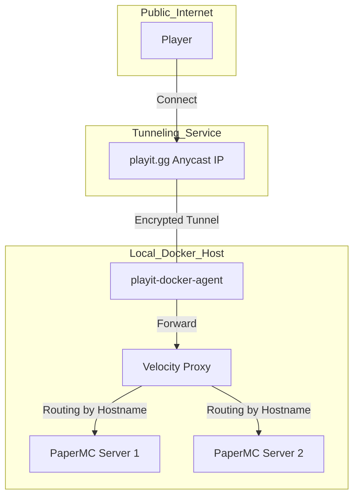

# Minecraft Network Infrastructure
**Docker + Velocity + playit.gg**

## 📌 概要
本プロジェクトは、Dockerコンテナを用いたMinecraftマルチサーバー環境の構築を目的とする。
ポート開放を行わず、playit.ggのトンネリング技術とVelocityプロキシを組み合わせることで、単一のエントリポイントから複数のサーバーへのルーティングを実現する。

## 🛠 技術スタック
| カテゴリ | 選定技術 | 役割 |
| :--- | :--- | :--- |
| **Virtualization** | Docker / Docker Compose | サーバー環境のコンテナ化・一元管理 |
| **Server Image** | [itzg/minecraft-server](https://github.com/itzg/docker-minecraft-server) | マインクラフトサーバー専用の最適化イメージ |
| **Proxy** | Velocity | プレイヤーの接続先（サブドメイン等）に応じた転送 |
| **Game Engine** | PaperMC | 高いパフォーマンスとプラグイン互換性を備えたエンジン |
| **Network Tunnel** | playit.gg | ポート開放不要な外部公開用トンネルの構築 |

## 🏗 システム構成


## 📂 ディレクトリ構成
```
.
├── docker-compose.yml     # 全コンテナの定義
├── .gitignore             # 永続データおよび機密情報の除外設定
├── playit/                # playit.gg 設定保持用
├── velocity/              # Velocity プロキシ設定
│   ├── velocity.toml      # サーバー振り分けルール
│   └── forwarding.secret  # サーバー間通信用秘密鍵
├── server-1/              # PaperMC インスタンス1
│   └── server.properties
└── server-2/              # PaperMC インスタンス2
    └── server.properties
```

## 🚀 セットアップ手順

### 1. リポジトリの準備

```bash
git clone https://github.com/neo-himeno/mc-infra.git
cd mc-infra
```

### 2. 環境変数の設定

`.env.example` から `.env` を作成し、playit.gg のシークレットキーを設定します。

```bash
cp .env.example .env
# .env を編集して PLAYIT_SECRET_KEY を入力
```

**PLAYIT_SECRET_KEY の取得方法：**
1. https://playit.gg/login/create でアカウント作成
2. ダッシュボードでシークレットキー（API Key）を生成
3. `.env` の `PLAYIT_SECRET_KEY` 値を置き換え

### 3. コンテナの起動

```bash
docker compose up -d
```

### 4. playit.gg のトンネル確立を確認

```bash
docker compose logs -f playit
```

ログに `[INFO]` で接続完了が表示されたら、 **Ctrl+C** で終了します。

### 5. Velocity の設定

`velocity/velocity.toml` を編集し、各サーバーへのルーティング設定（ホスト名と転送先）を定義します。  
設定後、コンテナを再起動して反映させます。

```bash
docker compose restart velocity
```

## 🔐 運用上の注意

### 秘密情報の管理
- **`.env` ファイル**: `PLAYIT_SECRET_KEY` を含む環境ファイル。`.gitignore` により Git管理外です。**絶対にコミットしないでください**。
- **`playit/` ディレクトリ**: playit.gg のトークン・設定を含む。自動生成されるため、リポジトリには含まれません。
- **`velocity/forwarding.secret`**: Velocity内部通信用の秘密鍵。`.gitignore` により保護されています。

### その他の注意事項
- **Persistence**: `world`, `logs`, `cache` などのゲームデータは `.gitignore` 対象です。永続データ用にボリュームマウントまたはバックアップ戦略が推奨されます。
- **Memory 設定**: コンテナメモリ割り当て（`docker-compose.yml` の `MEMORY` 環境変数）は、ホストマシンのリソースに応じて調整してください。
- **新規環境での再構築**: リポジトリをクローンして `docker compose up -d` を実行すれば、自動的にディレクトリが生成されて起動します。`.env` だけ忘れずに作成してください。
