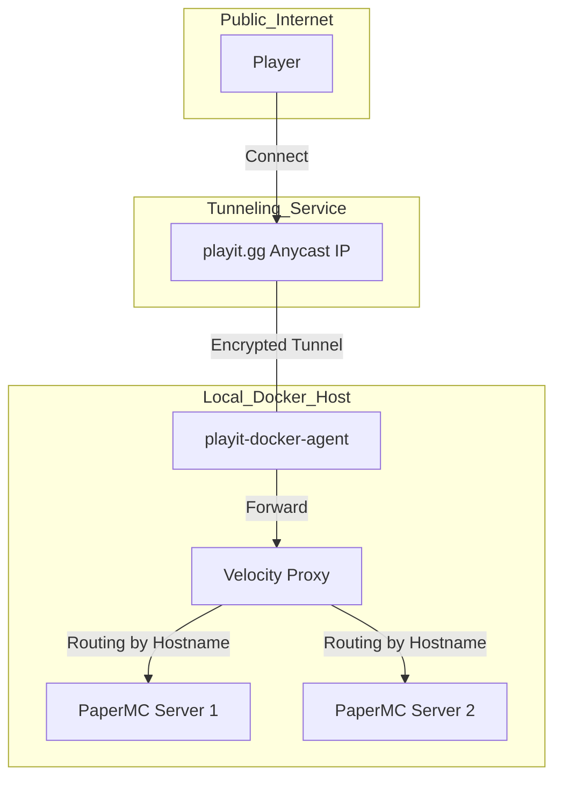

# Minecraft Network Infrastructure
**Docker + Velocity + playit.gg**

## 📌 概要
本プロジェクトは、Dockerコンテナを用いたMinecraftマルチサーバー環境の構築を目的とする。
ポート開放を行わず、playit.ggのトンネリング技術とVelocityプロキシを組み合わせることで、単一のエントリポイントから複数のサーバーへのルーティングを実現する。

## 🛠 技術スタック
| カテゴリ | 選定技術 | 役割 |
| :--- | :--- | :--- |
| **Virtualization** | Docker / Docker Compose | サーバー環境のコンテナ化・一元管理 |
| **Server Image** | [itzg/minecraft-server](https://github.com/itzg/docker-minecraft-server) | マインクラフトサーバー専用の最適化イメージ |
| **Proxy** | Velocity | プレイヤーの接続先（サブドメイン等）に応じた転送 |
| **Game Engine** | PaperMC | 高いパフォーマンスとプラグイン互換性を備えたエンジン |
| **Network Tunnel** | playit.gg | ポート開放不要な外部公開用トンネルの構築 |

## 🏗 システム構成


## 📂 ディレクトリ構成
```
.
├── docker-compose.yml     # 全コンテナの定義
├── .gitignore             # 永続データおよび機密情報の除外設定
├── playit/                # playit.gg 設定保持用
├── velocity/              # Velocity プロキシ設定
│   ├── velocity.toml      # サーバー振り分けルール
│   └── forwarding.secret  # サーバー間通信用秘密鍵
├── server-1/              # PaperMC インスタンス1
│   └── server.properties
└── server-2/              # PaperMC インスタンス2
    └── server.properties
```

## 🚀 セットアップ手順
1. **リポジトリの準備**

```bash
git clone https://github.com/neo-himeno/mc-infra.git
cd mc-infra
```

2. **コンテナの起動**

```bash
docker compose up -d
```

3. **playit.gg のアクティベート**

起動後、エージェントのログを確認し、表示されたURLからトンネルの認証を行います。

```bash
docker compose logs -f playit
```

4. **Velocity の設定**

`velocity/velocity.toml` を編集し、各サーバーのホスト名（サブドメイン）と転送先を定義します。  
その後、コンテナを再起動して設定を反映させます。

```bash
docker compose restart velocity
```

## 🔐 運用上の注意

- **Security**: `forwarding.secret` や `playit.toml` は機密情報を含むため、公開リポジトリへのコミットを避けてください。
- **Persistence**: `world` フォルダ等は `.gitignore` により管理外となっています。別途バックアップ戦略が必要です。
- **Memory**: 各コンテナのメモリ割り当て（環境変数 `MEMORY`）は、ホストマシンのリソースに応じて調整してください。
